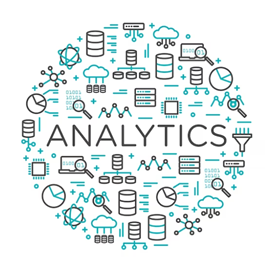

# Data Scientist

#### Technical Skills: Python, SQL, Data Analysis • Data Visualization • Tableau

## Education
- Certified in Data Science and AI - Institute of Data (Virginia Commonwealth U accredited)  | Feb 2025
- Associate Data Analyst in SQL - Datacamp | February 2025 						       		
- Master in Management - University of Phoenix | January 2016
- Bachelor in Business Administration - De La Salle University | August 2010	 			        		
- Lean Six Sigma Black Belt Certificate | December 2022
- PMP Exam Course -  TIA Education | 2023
- Certification in Data Visualisation: Empowering Business with Effective Insights - TATA The Forage | December 2024

## Projects
### USA Olympics Participation in 100 years

Analysis of female and male participation through history of Olympic games, performing data cleaning and visualization to understand growth of US female participation in Summer Olympics. 

### Movie Revenue Projection

Analysis of projected revenue for a new movie based on known variables and using supervised machine learning models such linear and logistics regression.

### Volleyball Recruitment

Predictive Modeling of Spiking Opportunity in Volleyball using Data Analysis and Machine Learning.

### Child’s Height

Predictive Modeling of Child Height Based on Parental Height and Gender using Machine Learning.
